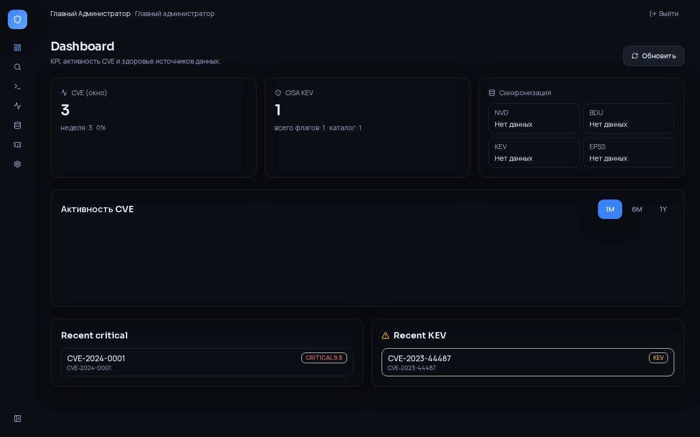
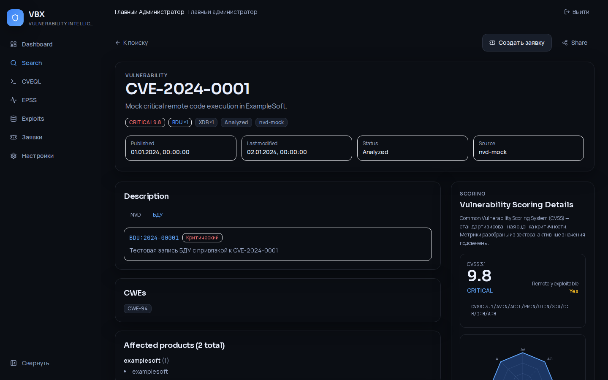
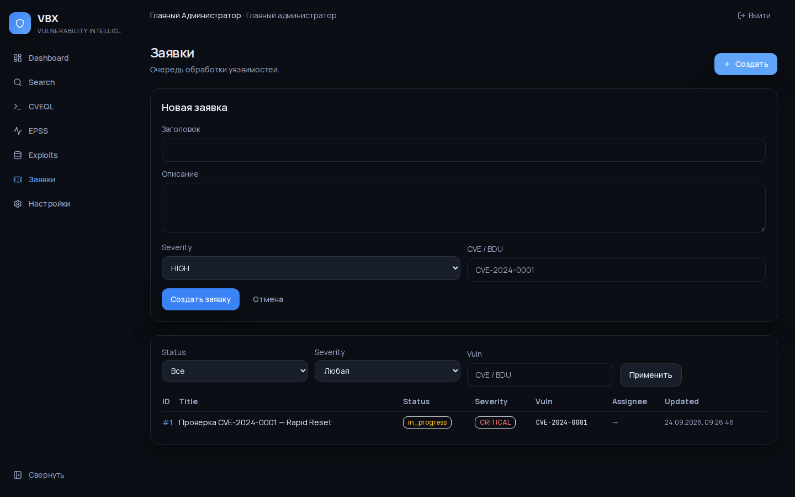
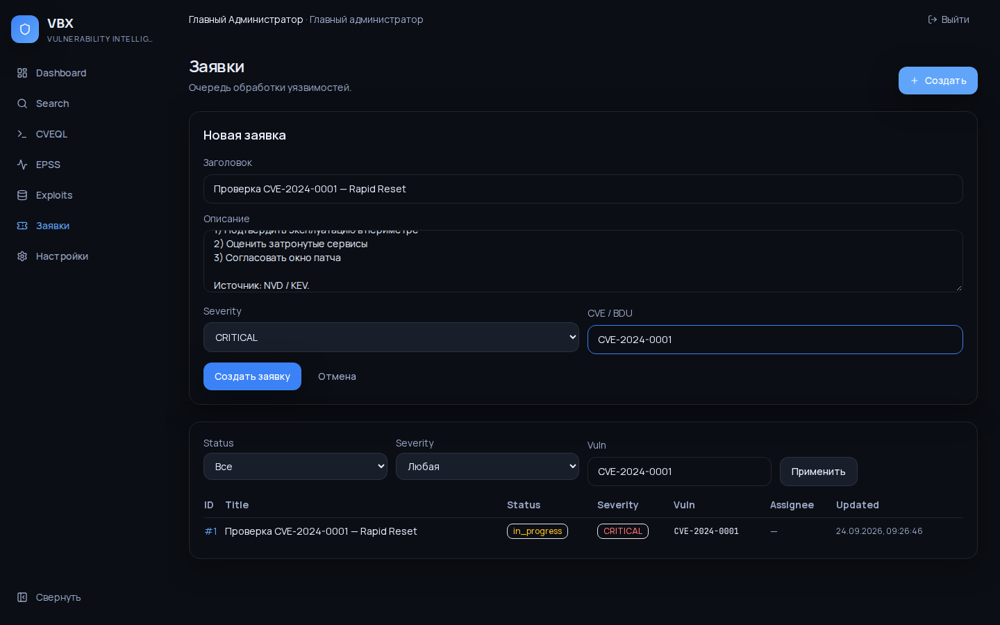
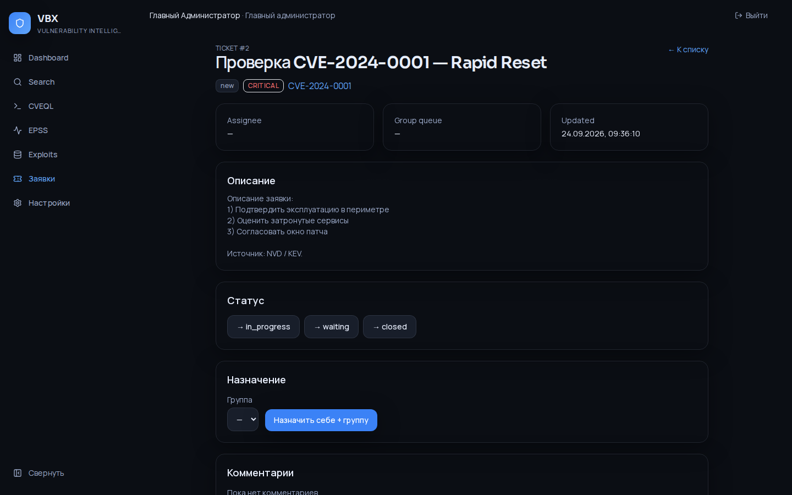
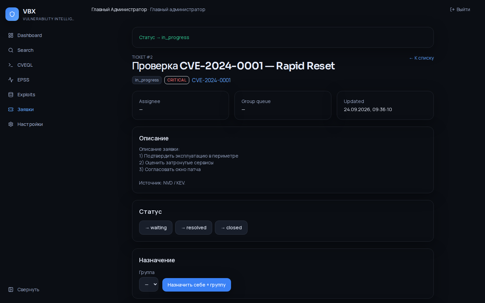
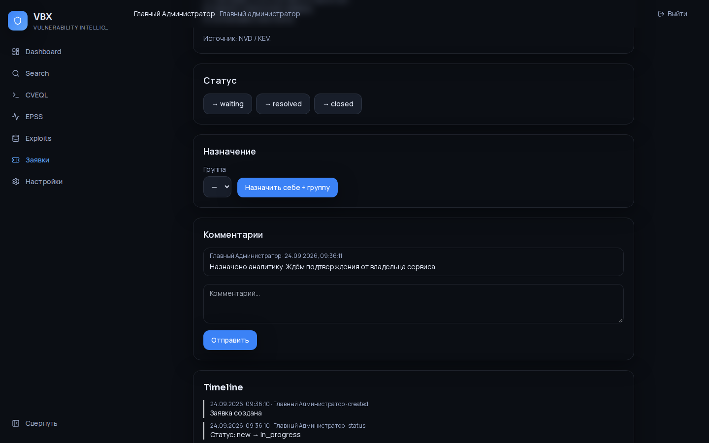
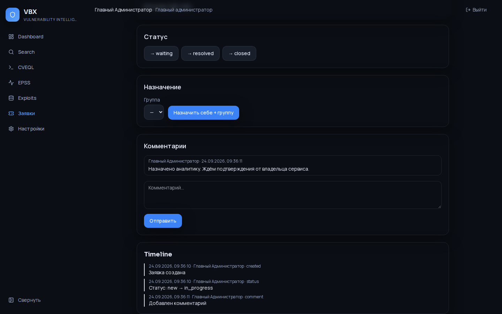

# VBXSystem

**VBXSystem** — on‑prem платформа vulnerability intelligence для команд ИБ:  
единый каталог уязвимостей (NVD + БДУ ФСТЭК + CISA KEV + EPSS + XDB) и внутренняя очередь заявок на обработку.

Интерфейс на русском, тёмная тема в духе [cvefeed.io](https://cvefeed.io/), бренд **VBX**.  
Разворачивается Docker Compose’ом или интерактивным установщиком на **РЕД ОС**.

---

## Что это за система

| Слой | Назначение |
|------|------------|
| **Каталог** | Поиск и карточки CVE / БДУ / локальных записей `VBX-YYYY-NNNN` |
| **Риски** | CVSS, CISA KEV, EPSS, CVEQL, каталог эксплойтов (XDB) |
| **Операции** | Заявки: создание → статус → назначение → комментарии → timeline |
| **Админка** | Пользователи/RBAC, брендинг, sync источников, метрики хоста, API‑ключи |
| **Платформа** | Next.js + FastAPI + Postgres + Redis + worker синхронизации |

```
   Browser ──► web (Next.js) ──/api/*──► api (FastAPI) ◄── worker
                                            │
                                   ┌────────┴────────┐
                                   ▼                 ▼
                               Postgres            Redis
```

**Типичный сценарий:** аналитик находит CVE в Search → открывает карточку → создаёт заявку с severity и описанием → меняет статус, пишет комментарий → админ смотрит sync источников и метрики хоста.

---

## Быстрый старт

```bash
cp .env.example .env
docker compose up -d --build
```

- UI: http://localhost/login (`VBX_HTTP_PORT`, по умолчанию `80`)
- Супер‑админ: `VBX_ADMIN_*` из `.env`

```bash
curl -s http://localhost:8000/health
curl -s http://localhost:8000/ready
bash deploy/redos/validate-install.sh
```

---

## Видео‑превью

Тур по UI (~40 с): login → dashboard (сайдбар) → search → CVE/БДУ → CVEQL/EPSS/XDB → **заявки (создание и заполнение)** → настройки.


MP4: [docs/demo/ui-preview.mp4](docs/demo/ui-preview.mp4) · постер: [docs/demo/ui-preview-poster.png](docs/demo/ui-preview-poster.png)

---

## Скриншоты UI

Галерея переснята с актуального UI (сворачиваемый сайдбар **без линий и без цветового шва** в развёрнутом и свёрнутом виде).

### Auth

| Login | Register |
|-------|----------|
|  |  |

### Основные разделы

| Dashboard | Sidebar свёрнут |
|-----------|-----------------|
|  |  |

| Search | CVE detail |
|--------|------------|
|  |  |

| Scoring Details | CVE · вкладка БДУ |
|-----------------|-------------------|
|  |  |

| BDU detail | CVEQL |
|------------|-------|
|  |  |

| EPSS | Exploits (XDB) |
|------|----------------|
|  |  |

| Локальная запись |
|------------------|
|  |

### Заявки — создание и заполнение

| Список | Форма «Новая заявка» |
|--------|----------------------|
|  |  |

| Заполненная форма | Карточка заявки |
|-------------------|-----------------|
|  |  |

| Статус → in_progress | Комментарий |
|----------------------|-------------|
|  |  |

| Timeline событий |
|------------------|
|  |

### Настройки

| Профиль | Пользователи |
|---------|--------------|
|  |  |

| Уведомления | Безопасность |
|-------------|--------------|
|  |  |

| Брендинг | База данных (NVD / БДУ URL) |
|----------|----------------------------|
|  |  |

| Система | Интеграции |
|---------|------------|
|  |  |

| API keys |
|----------|
|  |

Пересъём галереи: `npx playwright test e2e/capture-gallery.spec.ts`

---

## Установка на РЕД ОС (minimal)

Интерактивный мастер сам спрашивает креды по этапам (сеть → PostgreSQL → Redis → SECRET_KEY → профиль Admin → доп. УЗ → firewall).  
Пароль **Admin всегда генерируется** в конце и печатается один раз.

```bash
sudo bash deploy/redos/install.sh
```

Или из conf:

```bash
cp deploy/redos/vbx.conf.example /root/vbx.conf
sudo bash deploy/redos/install.sh /root/vbx.conf
sudo less /opt/vbx/VBX_INSTALL_INFO.txt
```

Подробности: [docs/ops/INSTALL_REDOS.md](docs/ops/INSTALL_REDOS.md).

| Документ | Содержание |
|----------|------------|
| [INSTALL_REDOS.md](docs/ops/INSTALL_REDOS.md) | Установка с нуля |
| [BACKUP.md](docs/ops/BACKUP.md) | `scripts/backup.sh` / `restore.sh` |
| [UPGRADE.md](docs/ops/UPGRADE.md) | Обновление релиза |
| [SECURITY_CHECKLIST.md](docs/ops/SECURITY_CHECKLIST.md) | Hardening |
| [USER_GUIDE_RU.md](docs/ops/USER_GUIDE_RU.md) | Краткая инструкция пользователя |
| [PERFORMANCE.md](docs/ops/PERFORMANCE.md) | Индексы и ориентиры |

---

## Структура репозитория

```
apps/api           FastAPI + Alembic + RBAC seed
apps/web           Next.js (App Router), UI в стилистике cvefeed
deploy/redos       установщик РЕД ОС + validate-install.sh
scripts/           backup / restore
docs/screenshots/  галерея UI
docs/demo/         видео-превью (GIF + MP4)
e2e/               Playwright (+ capture-gallery)
```

---

## Тесты

```bash
cd apps/api && pip install -r requirements.txt && pytest -q
npm install && npx playwright install chromium && npm run test:e2e
```

---

## Статус

Волны **W0–W9** закрыты (W9 — обогащение UI/ops из VULNEX).  
План W10–W11: [docs/ENRICHMENT_FROM_VULNEX.md](docs/ENRICHMENT_FROM_VULNEX.md) · [docs/STATUS.md](docs/STATUS.md).
