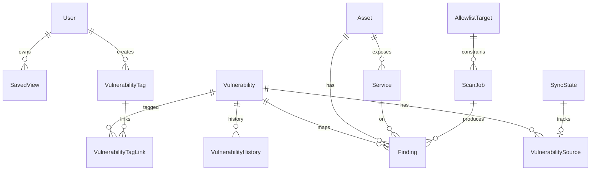

# Доменная модель VBXSystem

ORM: Drizzle → PostgreSQL. Ниже — логические сущности Wave 0 (контракт). Физические имена таблиц могут быть snake_case.

## Обзор связей

## Сущности

### User

Учётная запись консоли.

| Поле | Тип | Описание |
|------|-----|----------|
| `id` | uuid PK | |
| `email` | text unique | Логин |
| `name` | text | Отображаемое имя |
| `role` | enum: `viewer` \| `analyst` \| `admin` | RBAC |
| `emailVerified` | boolean | Better Auth |
| `createdAt` / `updatedAt` | timestamptz | |

Сессии/аккаунты Better Auth — отдельные таблицы библиотеки (не дублируем в домене).

### Asset

Хост или логический актив.

| Поле | Тип | Описание |
|------|-----|----------|
| `id` | uuid PK | |
| `name` | text | Имя |
| `hostname` | text nullable | FQDN |
| `ip` | inet/text nullable | IP |
| `environment` | text nullable | prod/stage/… |
| `criticality` | enum/int | Бизнес-критичность |
| `notes` | text nullable | |
| `createdAt` / `updatedAt` | timestamptz | |
| `createdById` | uuid FK → User nullable | |

**Индексы:** `(ip)`, `(hostname)`, `(environment)`.

### Service

Сетевой сервис на активе.

| Поле | Тип | Описание |
|------|-----|----------|
| `id` | uuid PK | |
| `assetId` | uuid FK → Asset | |
| `port` | int | |
| `protocol` | text | tcp/udp |
| `name` | text nullable | product/service name |
| `product` | text nullable | |
| `version` | text nullable | |
| `banner` | text nullable | |
| `firstSeenAt` / `lastSeenAt` | timestamptz | |
| `createdAt` / `updatedAt` | timestamptz | |

**Индексы:** unique `(assetId, port, protocol)`; `(product)`.

### Vulnerability

Запись каталога (CVE и/или БДУ).

| Поле | Тип | Описание |
|------|-----|----------|
| `id` | uuid PK | |
| `cveId` | text unique nullable | `CVE-YYYY-NNNN…` |
| `bduId` | text unique nullable | Идентификатор БДУ |
| `title` | text | Краткий заголовок |
| `description` | text | Описание |
| `severity` | enum computed nullable | `none\|low\|medium\|high\|critical` |
| `cvssScore` | numeric(3,1) nullable | max CVSS v3.1 across sources |
| `cvssVector` | text nullable | CVSS v3.1 vector |
| `cvssV2Score` / `cvssV2Vector` | nullable | если есть |
| `cvssV4Score` / `cvssV4Vector` | nullable | если есть |
| `epssScore` | numeric nullable | 0..1 |
| `kev` | boolean default false | CISA KEV |
| `vendors` / `products` / `cwes` / `cpes` | jsonb string[] | денормализованные списки |
| `references` | jsonb | `{url, source?, tags?}[]` |
| `affected` | jsonb | vendor/product/status/versions/cpe |
| `publishedAt` | timestamptz nullable | upstream published |
| `updatedAt` | timestamptz nullable | upstream lastModified |
| `localSyncedAt` | timestamptz nullable | последний локальный upsert (сортировка Updated / Recent) |
| `createdAt` | timestamptz | локальное создание строки |
| `analystNotes` | text nullable | MVP enrichment placeholder |

#### Severity (computed)

`severity` вычисляется из `max(cvssScore)` при upsert (`src/lib/domain/severity.ts`):

| CVSS 3.1 | severity |
|----------|----------|
| null | `null` (UI: «—») |
| 0.0 | `none` |
| 0.1–3.9 | `low` |
| 4.0–6.9 | `medium` |
| 7.0–8.9 | `high` |
| 9.0–10.0 | `critical` |

При расхождении NVD и BDU: исходные severity/score хранятся в `VulnerabilitySource`; верхний уровень = более критичное из двух (`maxSeverity` / `maxCvss`).

**Индексы:** unique на `cveId` / `bduId`; `(severity)`; `(cvssScore)`; `(kev)`; `(epssScore)`; `(localSyncedAt)`; GIN/trgm на `description` (TODO Wave 1 при pg_trgm).

### VulnerabilitySource

Происхождение/снимок данных по уязвимости.

| Поле | Тип | Описание |
|------|-----|----------|
| `id` | uuid PK | |
| `vulnerabilityId` | uuid FK | |
| `source` | enum: `nvd` \| `bdu` | |
| `rawPayload` | jsonb nullable | полный/усечённый raw |
| `fetchedAt` | timestamptz | |
| `checksum` | text nullable | Для идемпотентности |

**Индексы:** unique `(source, externalId)`; `(vulnerabilityId, source)`.

### VulnerabilityTag

Пользовательский тег каталога.

| Поле | Тип | Описание |
|------|-----|----------|
| `id` | uuid PK | |
| `name` | text unique | Нормализованное имя |
| `color` | text nullable | UI hint |
| `createdById` | uuid FK nullable | |
| `createdAt` | timestamptz | |

### VulnerabilityTagLink

M2M уязвимость ↔ тег.

| Поле | Тип | Описание |
|------|-----|----------|
| `vulnerabilityId` | uuid FK | |
| `tagId` | uuid FK | |
| `createdAt` | timestamptz | |

**PK:** `(vulnerabilityId, tagId)`.

### SavedView

Сохранённый срез фильтров/колонок для каталога (и потенциально findings).

| Поле | Тип | Описание |
|------|-----|----------|
| `id` | uuid PK | |
| `userId` | uuid FK → User | Владелец |
| `name` | text | |
| `scope` | enum: `vulnerabilities` \| `findings` \| `assets` | |
| `query` | text nullable | Advanced search string |
| `filters` | jsonb | Структурированные фильтры |
| `columns` | jsonb nullable | Видимые колонки |
| `sort` | jsonb nullable | |
| `isShared` | boolean default false | Видимость другим (admin/analyst) |
| `createdAt` / `updatedAt` | timestamptz | |

**Индексы:** `(userId, scope)`; unique `(userId, scope, name)`.

### VulnerabilityHistory

Аудит изменений записи каталога.

| Поле | Тип | Описание |
|------|-----|----------|
| `id` | uuid PK | |
| `vulnerabilityId` | uuid FK | |
| `changedAt` | timestamptz | |
| `changeType` | enum: `created` \| `updated` \| `source_sync` \| `tag` | |
| `diff` | jsonb | До/после ключевых полей |
| `actorUserId` | uuid nullable | null = system/worker |
| `source` | text nullable | `nvd` / `bdu` / `ui` |

**Индексы:** `(vulnerabilityId, changedAt desc)`.

### Finding

Обнаружение на активе/сервисе.

| Поле | Тип | Описание |
|------|-----|----------|
| `id` | uuid PK | |
| `vulnerabilityId` | uuid FK nullable | Связь с каталогом |
| `assetId` | uuid FK | |
| `serviceId` | uuid FK nullable | |
| `scanJobId` | uuid FK nullable | |
| `title` | text | |
| `severity` | enum | snapshot на момент обнаружения |
| `status` | enum: `open` \| `confirmed` \| `risk_accepted` \| `fixed` \| `false_positive` | |
| `evidence` | jsonb nullable | Вывод сканера |
| `firstSeenAt` / `lastSeenAt` | timestamptz | |
| `closedAt` | timestamptz nullable | |
| `createdAt` / `updatedAt` | timestamptz | |

**Индексы:** `(status)`; `(assetId, status)`; `(vulnerabilityId)`; `(scanJobId)`.

### ScanJob

Задание сканирования.

| Поле | Тип | Описание |
|------|-----|----------|
| `id` | uuid PK | |
| `type` | enum: `nmap` \| `nuclei` | |
| `target` | text | IP/CIDR/host (должен пройти allowlist) |
| `status` | enum: `queued` \| `running` \| `succeeded` \| `failed` \| `cancelled` | |
| `requestedById` | uuid FK | |
| `allowlistTargetId` | uuid FK nullable | |
| `params` | jsonb | Профиль, templates path, ports |
| `startedAt` / `finishedAt` | timestamptz nullable | |
| `errorMessage` | text nullable | |
| `artifactPath` | text nullable | Путь к сырому отчёту |
| `createdAt` / `updatedAt` | timestamptz | |

**Индексы:** `(status, createdAt)`; `(requestedById)`.

### SyncState

Состояние синхронизации источника.

| Поле | Тип | Описание |
|------|-----|----------|
| `id` | uuid PK | |
| `source` | enum unique: `nvd` \| `bdu` | |
| `cursor` | text nullable | lastModStartDate / offset |
| `lastSuccessAt` | timestamptz nullable | |
| `lastAttemptAt` | timestamptz nullable | |
| `lastError` | text nullable | |
| `stats` | jsonb nullable | counts upserted/skipped |
| `updatedAt` | timestamptz | |

### AllowlistTarget

Разрешённые цели сканирования.

| Поле | Тип | Описание |
|------|-----|----------|
| `id` | uuid PK | |
| `cidrOrHost` | text | IP, CIDR или hostname |
| `label` | text nullable | |
| `enabled` | boolean default true | |
| `createdById` | uuid FK | |
| `createdAt` / `updatedAt` | timestamptz | |
| `notes` | text nullable | |

**Индексы:** unique `(cidrOrHost)`; `(enabled)`.

## Инварианты

1. Хотя бы одно из `cveId` / `bduId` должно быть задано у `Vulnerability` (check constraint).
2. `ScanJob` создаётся только если `target` ⊆ enabled `AllowlistTarget`.
3. Nuclei-профиль: только детектирующие templates из `cves/` / `vulnerabilities/` (см. [features/scans.md](../features/scans.md)).
4. `severity` на `Vulnerability` пересчитывается при изменении `cvss31Score`.
5. Upsert NVD/BDU идемпотентен по `(source, externalId)` и checksum.

## Миграции

- Инструмент: `drizzle-kit`.
- Seed: демо-активы, allowlist localhost/lab, теги; admin — через bootstrap (см. [bootstrap-admin.md](../setup/bootstrap-admin.md)).

TODO (Wave 1+): финальные SQL-миграции, pg_trgm, partial indexes в коде схемы.
