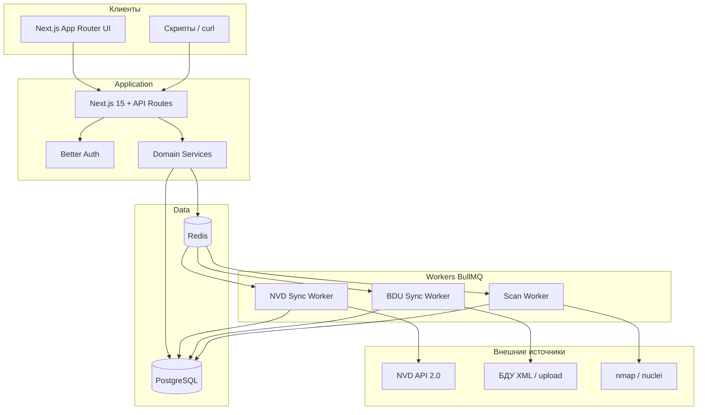
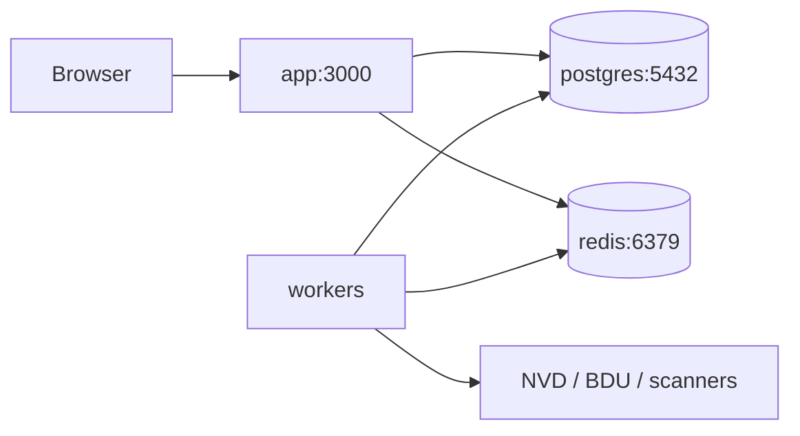

# Архитектура VBXSystem

## Назначение

VBXSystem (продуктовое имя **VBX** / пакет `vuln-mgmt`) — on-prem система управления уязвимостями:

- синхронизация каталога CVE из NVD и бюллетеней БДУ ФСТЭК;
- учёт активов и сетевых сервисов;
- контролируемое сканирование только по allowlist;
- findings с жизненным циклом статусов;
- роли viewer / analyst / admin.

Система рассчитана на внутренний контур организации (не SaaS multi-tenant).

## Высокоуровневая схема

## Компоненты

| Компонент | Технология | Роль |
|-----------|------------|------|
| Web UI + API | Next.js 15 (App Router), React 19 | Консоль, REST/Route Handlers |
| Auth | Better Auth (email/password) | Сессии, роли; задел LDAP/OIDC |
| ORM | Drizzle ORM + PostgreSQL | Доменная модель |
| Очереди | BullMQ + Redis | NVD/BDU sync, scan jobs |
| Валидация | Zod | Вход API и парсеры поиска |
| UI kit | shadcn/ui + TanStack Table/Query | Плотный консольный UX |

## Потоки данных

1. **Синхронизация уязвимостей.** Admin/analyst ставит job → worker тянет NVD или БДУ → upsert в `Vulnerability` + `VulnerabilitySource` → обновляет `SyncState` и `localSyncedAt`.
2. **Активы.** CRUD активов и сервисов; findings привязываются к `Asset` / `Service`.
3. **Сканирование.** Цель проверяется по `AllowlistTarget` → `ScanJob` → адаптер nmap/nuclei → findings. Вне allowlist — отказ.
4. **Триаж.** Analyst меняет статус finding; история уязвимостей пишется в `VulnerabilityHistory`.

## Границы ответственности

| В scope | Out of scope (сейчас) |
|---------|------------------------|
| On-prem один тенант | Multi-org SaaS, billing |
| Каталог CVE/BDU, теги, saved views | Slack/Teams алерты, AI enrichment |
| Allowlist scan (detect-only) | Auto-exploitation, offensive payload |
| Email/password + роли | Полноценный LDAP/OIDC (задел) |

## OpenCVE UX reference — что взяли / что нет

Подробности и лицензионный вывод: [ADR-004](../decisions/ADR-004-opencve-ux-reference.md).

### Взяли (паттерны UX/IA, не код)

- Плотная консоль «table-first» для каталога CVE.
- Фильтры и поле поиска над таблицей.
- Карточка детали с секциями (описание, CVSS, источники, даты).
- Сохранённые представления (saved views) как рабочие срезы.

### Не взяли

- Исходный код, брендинг, логотипы, trademark OpenCVE.
- Orgs / billing / Slack / AI enrichment / multi-tenant subscriptions.
- Любые артефакты под BSL 1.1 как копируемый код.

**Вывод:** VBX — самостоятельный продукт; OpenCVE используется только как визуально-информационный референс паттернов.

## Развёртывание (логическое)

Типичный локальный контур: `docker compose` для Postgres + Redis, приложение и workers через `pnpm`.

## Связанные документы

- [data-model.md](./data-model.md)
- [workers.md](./workers.md)
- [../setup/install.md](../setup/install.md)
