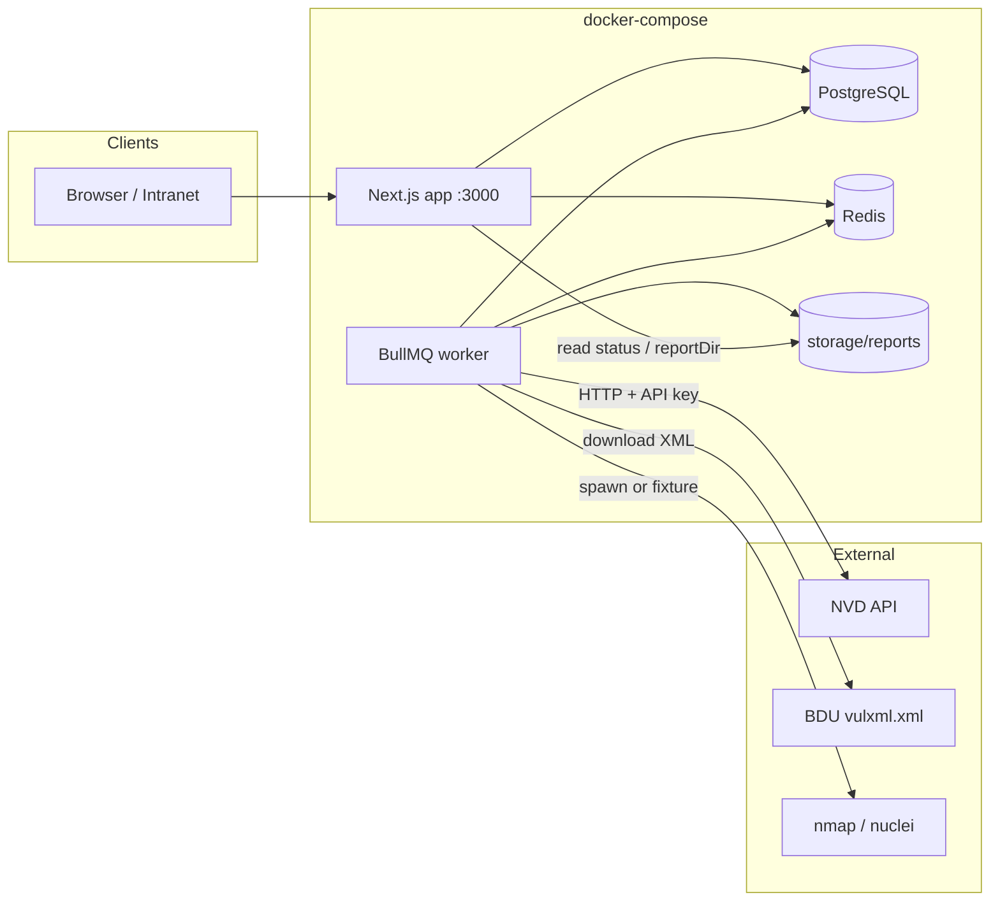
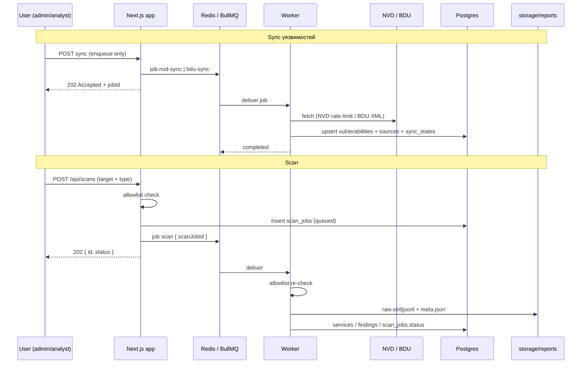

# Архитектура (обзор)

## Компоненты

| Компонент | Технология | Роль |
|-----------|------------|------|
| **app** | Next.js 16 (App Router) | UI + API routes; enqueue NVD/BDU/scan в BullMQ |
| **worker** | Node + BullMQ (`npm run worker`) | `nvd-sync`, `bdu-sync`, **`scan`** (адаптеры nmap/nuclei + stubs) |
| **postgres** | PostgreSQL 15 | Доменные данные, Better Auth таблицы |
| **redis** | Redis 7 | Очереди BullMQ |
| **storage** | том `./storage` | BDU XML (`storage/bdu/`), сырые отчёты сканов (`storage/reports/<jobId>/`) |

Wave 3: сканы и findings реализованы end-to-end (fixture + optional binaries); zap/openvas — stubs.

## Диаграмма компонентов

## Потоки данных

## Границы ответственности

- **App**: auth, CRUD UI, валидация allowlist перед enqueue scan, чтение статусов/findings, PATCH finding status.
- **Worker**: сеть к NVD/BDU, парсинг, запись в БД, запуск адаптеров сканеров (или fixture), persist findings/services.
- **Не в app-процессе**: долгий download/parse NVD/BDU и выполнение сканов — только через очередь (исключение: CLI `smoke:scan` вызывает `runScanJob` inline для демо без double-enqueue).

## Связанные документы

- [data-model.md](data-model.md)
- [workers.md](workers.md)
- [ADR-001](../decisions/ADR-001-stack.md)
- [ADR-003 scan adapters](../decisions/ADR-003-scan-adapters.md)
- [features/scans.md](../features/scans.md)
- [features/findings.md](../features/findings.md)
