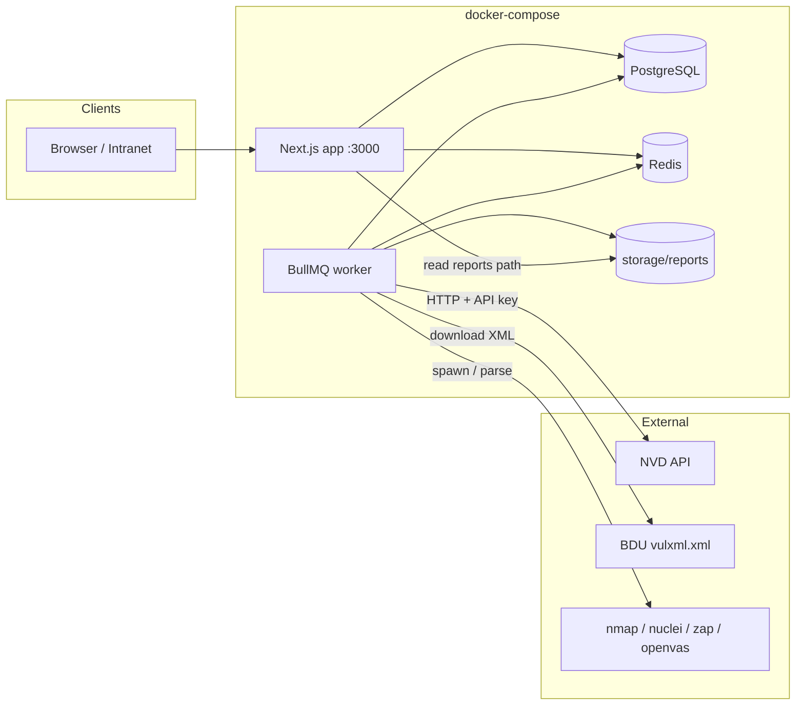
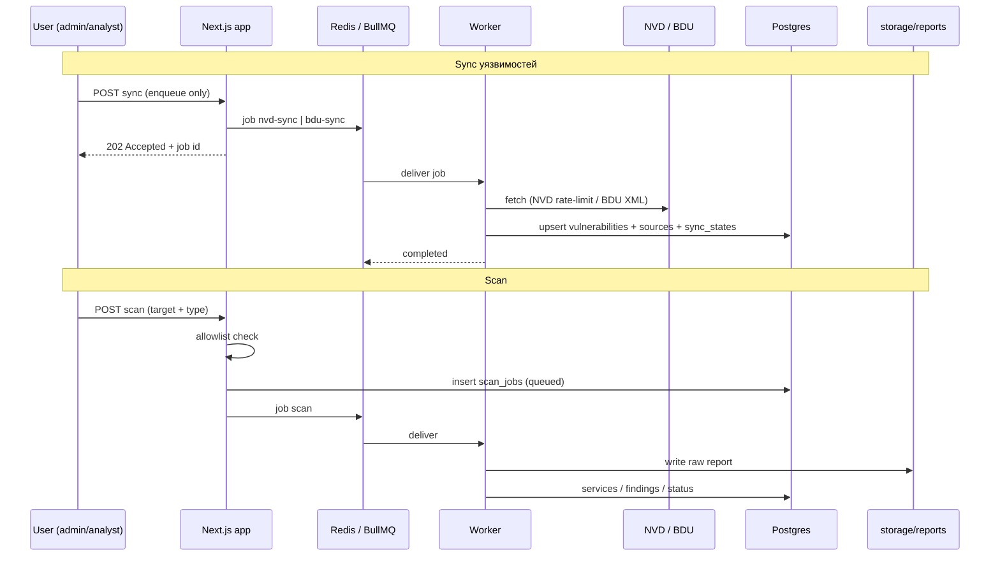

# Архитектура (обзор)

## Компоненты

| Компонент | Технология | Роль |
|-----------|------------|------|
| **app** | Next.js 16 (App Router) | UI + API routes; enqueue долгих задач в BullMQ |
| **worker** | Node + BullMQ (`npm run worker`) | Обработка `nvd-sync`, `bdu-sync`, `scan` |
| **postgres** | PostgreSQL 15 | Доменные данные, Better Auth таблицы |
| **redis** | Redis 7 | Очереди BullMQ |
| **storage** | том `./storage` / `./storage/reports` | Сырые отчёты сканеров, кэш BDU XML |

Wave 0: UI — placeholders, worker — stub (очереди объявлены, processors не зарегистрированы).

## Диаграмма компонентов

## Потоки данных

## Границы ответственности

- **App**: auth, CRUD UI, валидация allowlist перед enqueue, чтение статусов.
- **Worker**: сеть к NVD/BDU, парсинг, запись в БД, запуск адаптеров сканеров.
- **Не в app-процессе**: долгий download/parse NVD/BDU и выполнение сканов — только через очередь.

## Связанные документы

- [data-model.md](data-model.md)
- [workers.md](workers.md)
- [ADR-001](../decisions/ADR-001-stack.md)
